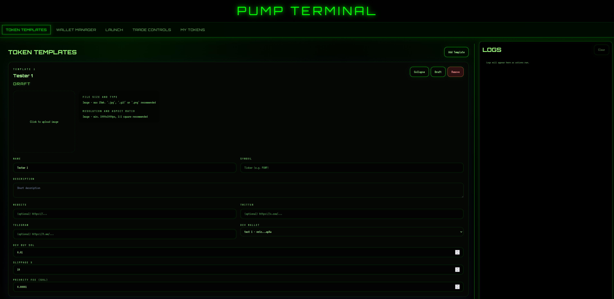
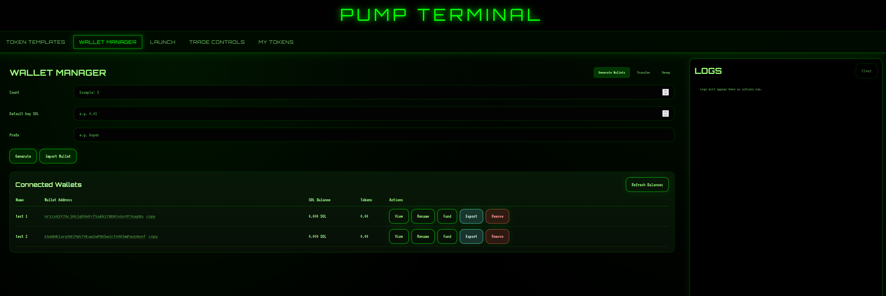
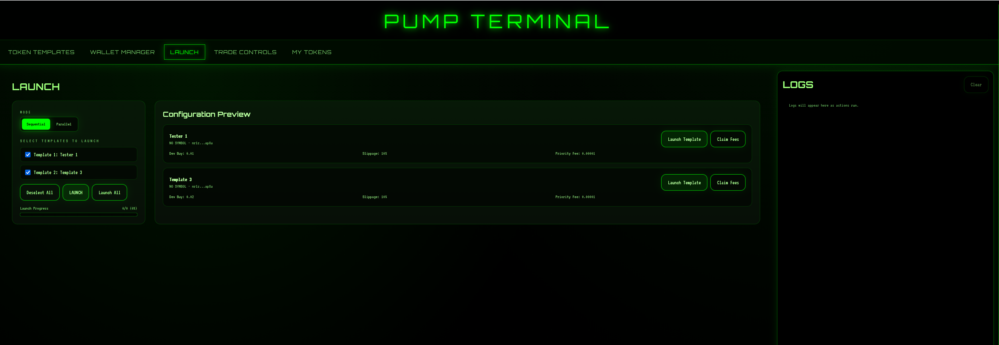
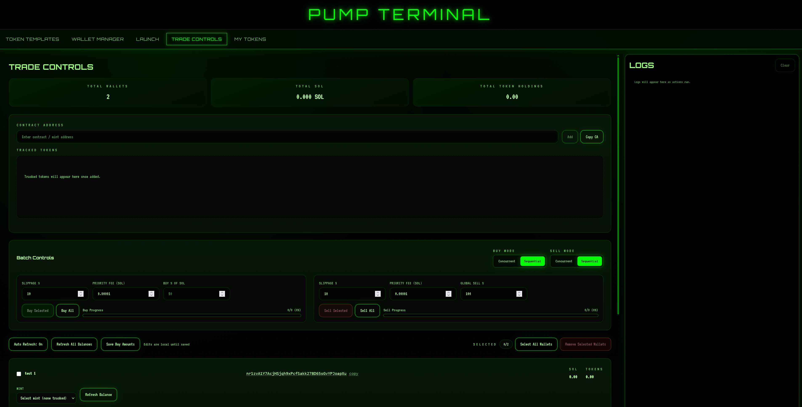
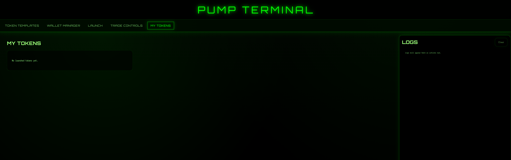

# Pump Terminal

Pump Terminal is a high-speed, self-hosted Solana launch and trading console built for teams that want to launch tokens, manage many wallets, and execute buys/sells from one control surface.

It is designed for real operations, not demos:
- Launch multiple tokens from reusable templates.
- Trade from multiple wallets at once.
- Track and rotate token contracts fast.
- Monitor everything through live mission logs.

## Live Preview

Preview video:
- [Pump Terminal live preview](example/video/pump_terminal_preview.mp4)

<video src="example/video/pump_terminal_preview.mp4" controls width="100%"></video>

## Why Pump Terminal

- Multi-wallet execution: Run batch and per-wallet trades from one interface.
- Multi-token operations: Launch and manage more than one token at the same time.
- Fast infra path: Uses Helius RPC for low-latency chain access and PumpPortal trade APIs for rapid route execution while tokens are on Pump.fun bonding curve.
- Unified workflow: Template authoring, launch, trading, wallet ops, and logs in one terminal.

## What You Can Do

- Trade Solana tokens from multiple wallets through the console, including Pump.fun, PumpSwap, Raydium, and other supported routing paths.
- Launch multiple new tokens and then buy/sell your own created tokens directly from the same terminal.
- Track token contract addresses and switch active mint context instantly for trading.
- Run concurrent or sequential batches for buys/sells and launches.
- Transfer and sweep SOL/SPL balances across managed wallets.

## Core Tabs and Features

### TOKEN TEMPLATES



- Create reusable token configs with:
  - Name, symbol, description
  - Website/Twitter/Telegram (optional)
  - Dev wallet selection per template
  - Dev buy amount, slippage, priority fee
  - Artwork upload + preview
- Save drafts and prepare many templates in one session.

### WALLET MANAGER



- Generate wallets in bulk with prefix and default buy settings.
- Import existing wallets.
- Rename wallets (propagates to trading views).
- Export/remove wallets.
- Transfer and sweep SOL/SPL from the same panel.

### LAUNCH



- Select one or many templates to launch.
- Launch in sequential or parallel mode.
- Track launch progress and trigger per-template launch actions.

### TRADE CONTROLS



- Track token contracts from CA input (server-validates mint accounts).
- Wallet-level controls:
  - Buy amount (SOL)
  - Buy percent of SOL
  - Sell percent
  - Per-wallet mint selection
- Batch controls:
  - Buy selected/all
  - Sell selected/all
  - Concurrency, slippage, priority fee, mode toggles
- Portfolio metrics:
  - Total wallets
  - Total SOL
  - Total token holdings

### MY TOKENS



- See launched tokens and quick actions.
- Jump to sell flows for created tokens.
- Claim creator fees where available.

### LOGS

- Live server-sent event (SSE) feed for:
  - Launch progress
  - Trade progress
  - Wallet operations
  - Errors and diagnostics

## Performance and Routing Stack

- RPC layer: Helius (`HELIUS_RPC_URL`) for fast account reads and transaction sends.
- Trade construction/routing: PumpPortal (`https://pumpportal.fun/api/trade-local`).
- Launch metadata upload: Pump.fun IPFS endpoint.
- Pool routing behavior:
  - Create flow uses Pump.fun route.
  - Trade flow defaults to `DEFAULT_POOL=auto` and supports Pump.fun/PumpSwap/Raydium-compatible paths exposed by routing backend.

## State and Persistence

State is stored in `data/state.json`.

- `trackedMints`: valid tracked token contracts.
- `recentMints`: recent launch history.
- `mint`: active mint in trade context.
- `lastCreateSig`: latest create transaction signature.

Wallet key storage:
- All signing wallets are loaded from `wallets/buyers.json`.
- There is no standalone `wallets/dev.json`; template fee/launch wallet selection uses connected buyer wallets.

Runtime notes:
- Tracked token entries are validated before persistence.
- CA input clears after submission.
- Balance snapshots are cached in-memory and not persisted.

## Project Structure

- `src/server.js`: backend entrypoint.
- `src/gui/server.js`: API routes, SSE logs, static client host.
- `src/trader.js`: batch buy/sell orchestration.
- `src/pumpportal.js`: PumpPortal and transaction build/send helpers.
- `src/walletOps.js`: transfer/sweep transaction utilities.
- `src/state.js`: persisted state helpers.
- `client/src/App.jsx`: main tabbed UI and event wiring.
- `client/src/api.js`: frontend API wrapper.
- `wallets/`: local wallet storage.
- `data/state.json`: terminal state.

## Setup

### Quick install (Windows)

```bat
install.bat
```

### Manual install

```bash
npm install
npm run client:install
```

Copy `.env.example` to `.env`, then configure values such as:

```bash
PORT=3001
HELIUS_RPC_URL=https://mainnet.helius-rpc.com/?api-key=your-api-key
DEFAULT_POOL=auto
```

## Running

### Development

Terminal 1:

```bash
npm run server
```

Terminal 2:

```bash
npm run client:dev
```

Open `http://localhost:5173`.

### Production-style

```bash
npm run client:build
npm start
```

Open `http://localhost:3001`.

## Scripts

- `npm run server`: start backend API/GUI server.
- `npm run client:dev`: run Vite client in dev mode.
- `npm run client:build`: build client to `client/dist`.
- `npm start`: run backend serving built client.

## Security and Risk Notice

- This software executes real blockchain transactions.
- Protect `.env` values and wallet keys.
- Test with small amounts first.
- Validate your routing and slippage settings before high-size batch operations.
